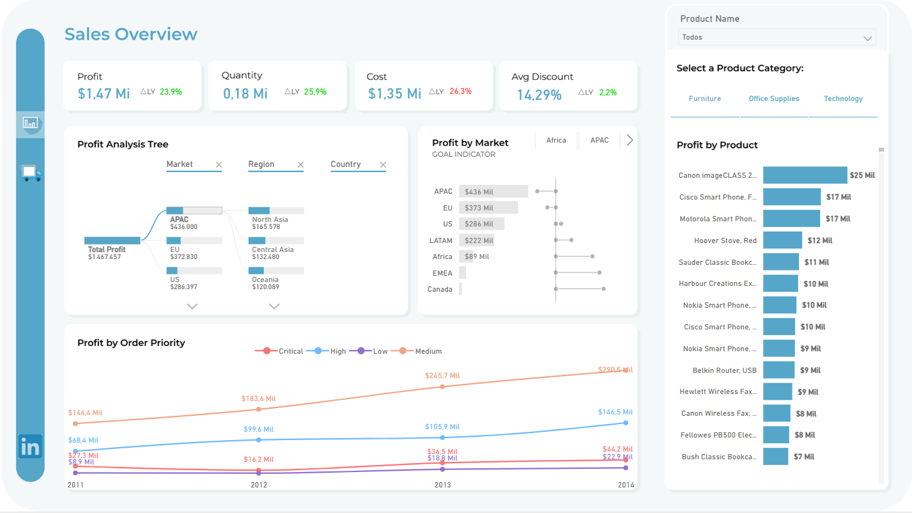

# 📊 Analytics & Business Intelligence

## 🎯 Contexto e Objetivo

O objetivo deste projeto foi aplicar conceitos práticos de **BI e Analytics**, transformando dados brutos em **informações estratégicas**, por meio de:

- Tratamento e preparação dos dados em Python
- Definição de indicadores-chave (KPIs)
- Criação de métricas em DAX
- Storytelling com dados e boas práticas de visualização


## 🛠️ Tecnologias e Ferramentas

- **Power BI** — Visualização e análise de dados
- **Power Query** — Limpeza e transformação dos dados
- **DAX** — Criação de métricas e indicadores
- **Python** — Análise exploratória dos dados
- **Git & GitHub** — Versionamento e documentação

---

## 📈 Dashboard Interativo

**Clique na imagem abaixo para acessar o dashboard interativo:**

[](https://app.powerbi.com/view?r=eyJrIjoiODU2ZmU1NmItNGE4NC00MGI1LTgxMzYtNDUwOGZlNTFmNDQ2IiwidCI6IjA2MjAxYjM4LWEwY2QtNGY5My1iMGZhLWJjMGE5YTUyYzQ3OSJ9)


## 📑 Estrutura Analítica do Dashboard

O dashboard foi organizado em **duas abas principais**, cada uma com um objetivo analítico específico:

#### 💵 Aba 1 — Visão de Lucratividade por Serviços/Produtos/Regiões de mercado
#### 🚚 Aba 2 — Visão de Performance de Entrega por Modalidade e Região de mercado

- Indicadores-chave (KPIs)
- Visão consolidada do cenário analisado
- Análises comparativas
- Filtros para exploração dinâmica
- Identificação de padrões e tendências
- Segmentações e recortes específicos

🎯 **Objetivo:** fornecer uma leitura rápida e executiva dos dados.


## 🔎 Tratamento de Dados

O projeto inclui um **notebook em Python**, utilizado como etapa de **preparação dos dados**.

Principais atividades:
- Carregamento e entendimento da base de dados
- Tratamento de valores ausentes e ajustes estruturais
- Normalização de tabelas

Biblioteca utilizada: pandas

---

## 🔄 Pipeline de Dados

O fluxo de trabalho do projeto segue um pipeline simples e eficiente de **Analytics & BI**:

```text
Dados Brutos
    ↓
Tratamento e Validação dos Dados (Python / Notebook)
    ↓
Normalização de tabelas
    ↓
Modelagem e Construção de Métricas e Visuais (Power BI / DAX)
    ↓
Dashboard Interativo
